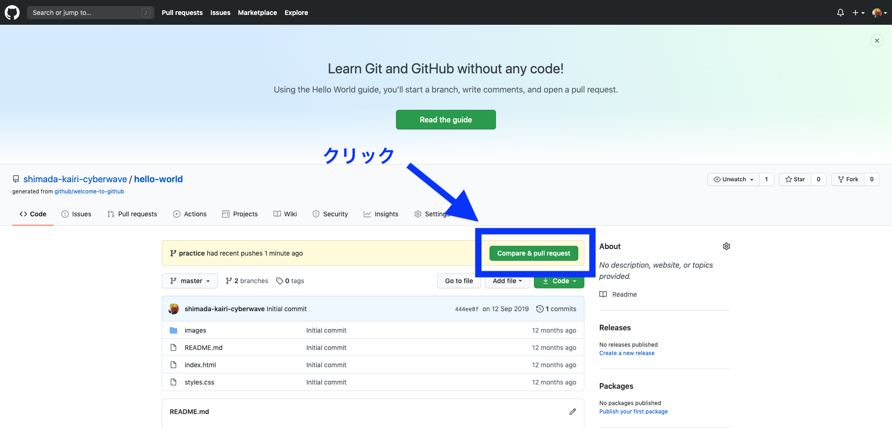
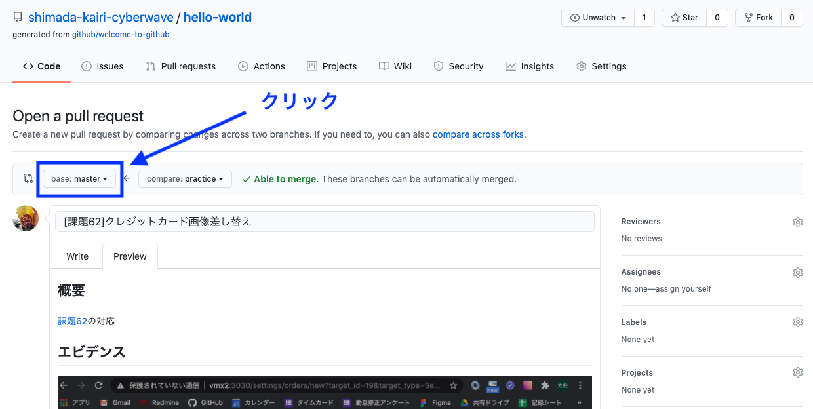
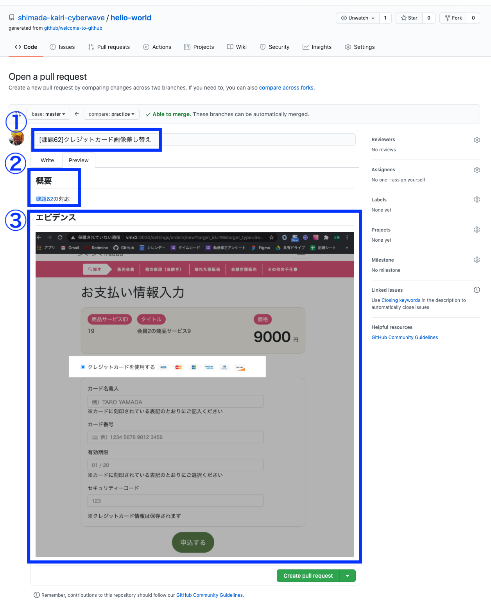
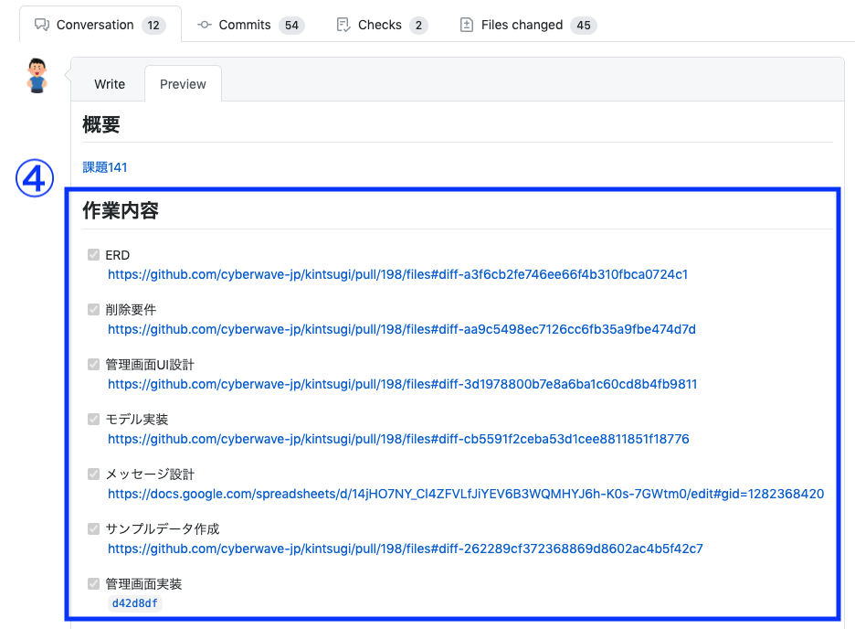
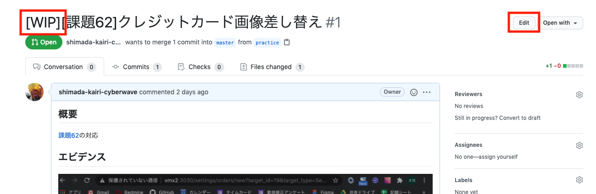
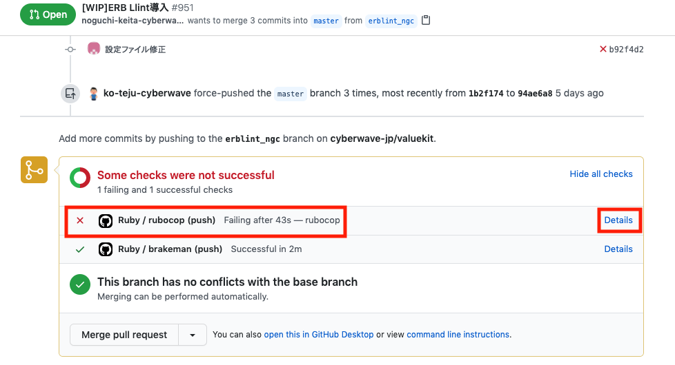

## GITHUBプルリクエスト作成まで

  1. ローカルで`git push`まで行う

  1. ブラウザから作業対象のリポジトリの画面を開き、`Compare & pull request`をクリック

     

  1. baseブランチの設定

     baseを親ブランチ(分岐元ブランチ)に設定する

      

  1. 概要の記述する

     ### 概要の書き方

      

      1. **タイトル**

         > 簡潔に作業内容がわかりやすいタイトルをつける 
         > 作業途中の場合には、行頭に[WIP]をつける(`レビューを出す時には、[WIP]を外すのを忘れずに`)

      2. **概要**

         > 変更に対する概要を記載する(課題Noや試験仕様書、issueのリンクを貼る)

      3. **エビデンス**

         > キャプチャやログを添付する

      4. **作業内容(任意)**

         > 一つのプルリクエスト内での作業が多くなる場合は、チェックボックスを使う(レビュ-のしやすさも意識する)

         

  1. ページ下部にある`Create pull request`ボタンをクリックする

-----------------------------------------------------------------

## レビューを出す前に確認項目

  * タイトルの[WIP]を外す(Editボタンからタイトルの編集ができます)

    

  * GitHub Actionsのエラーを解消する(detailsボタンからエラーの詳細が確認できます)

    

    * ローカルでの確認(コンソール上で、実行コマンド)

      * rubocopチェック → `rubocop`

      * brakemanチェック → `rake brakeman`

      * document linterチェック → `npm run documentlint`

------------------------------------------------------------------

## コラム

  * マークダウンの書き方

    > [Markdown記法　チートシート](https://qiita.com/Qiita/items/c686397e4a0f4f11683d)

